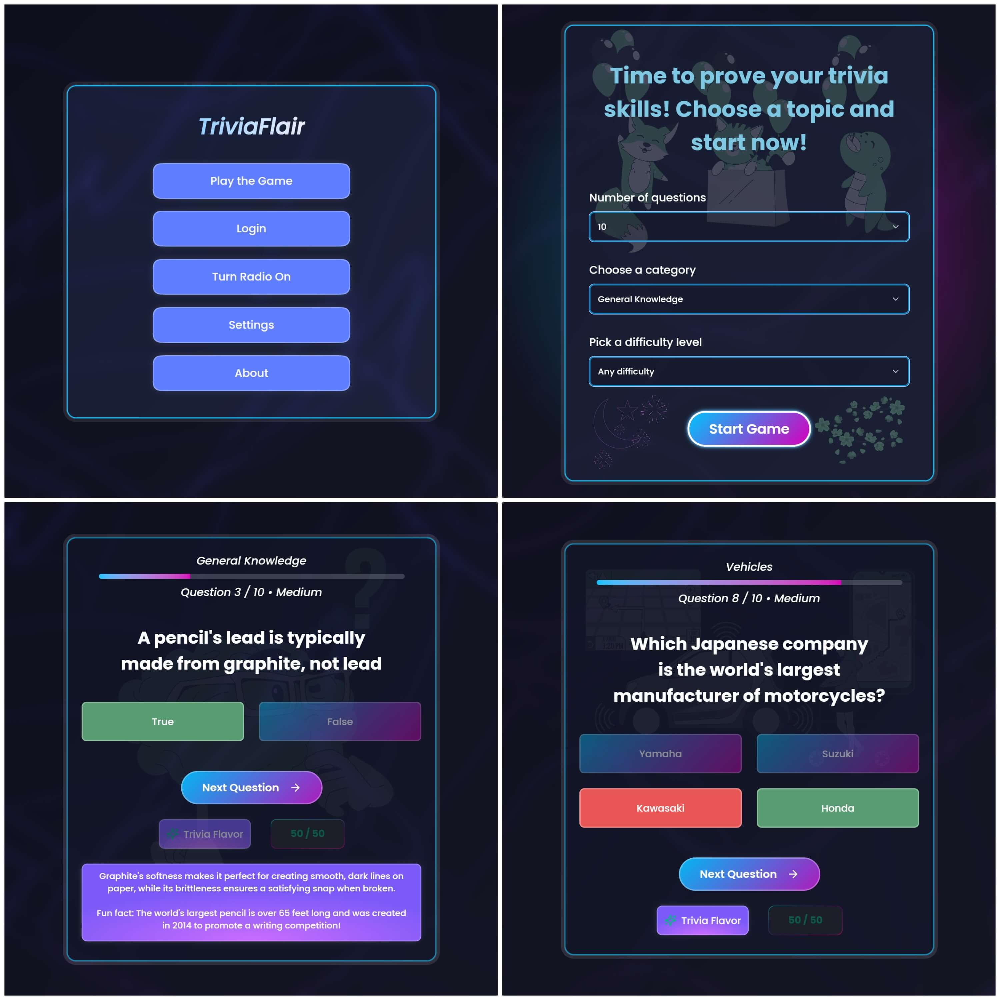
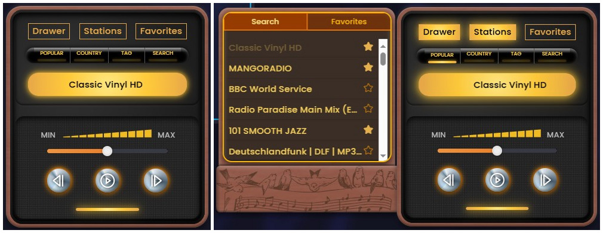

# 🧠 Trivia Flair 3.0

[](https://trivia-game-v3-frontend.onrender.com/)


A full-stack trivia game with integrated radio player! Built with React, TypeScript, Node.js, and MongoDB. Features trivia gameplay, AI-powered hints, and a fully functional radio widget with thousands of live stations.

🎮 **Live Demo**: [Frontend](https://trivia-game-v3-frontend.onrender.com/) | [Backend API](https://trivia-game-v3-backend.onrender.com)



## 📚 Table of Contents

- [✨ What's New in 3.0](#-whats-new-in-30)
  - [🎵 Radio Widget](#-radio-widget)
  - [🔐 User System](#-user-system)
  - [🚀 Backend Infrastructure](#-backend-infrastructure)
- [📱 Progressive Web App](#-progressive-web-app)
- [🎯 Features](#-features)
  - [Trivia Game](#trivia-game)
  - [Radio Player](#radio-player)
- [🛠️ Tech Stack](#️-tech-stack)
  - [Frontend](#frontend)
  - [Backend](#backend)
- [🎮 How to Play](#-how-to-play)
- [🙏 Acknowledgments](#-acknowledgments)
  - [APIs & Services](#apis--services)
  - [Assets & Libraries](#assets--libraries)
- [Installation](#installation)

## ✨ What's New in 3.0

### 🎵 **Radio Widget**
- 📻 30,000+ live radio stations worldwide
- 🔍 Search by country, tags, or station name
- ⭐ Favorite stations with persistent storage
- 🔊 Real-time audio streaming with Howler.js
- 🎛️ Volume control and playback management
- 📱 Responsive retro-style design



### 🔐 **User System** 
- 👤 User registration and authentication
- 🔐 JWT token-based authentication
- 🗄️ MongoDB user data storage
- 📱 Persistent login sessions

### 🚀 **Backend Infrastructure**
- 🛡️ Proxy server for Radio Browser API
- ⚡ Load balancing across multiple radio servers
- 💾 Caching for improved performance
- 🔄 Exponential backoff for error handling

[Backend Repository](https://github.com/Akiz-Ivanov/trivia-game-v3-backend)

## 📱 Progressive Web App

TriviaFlair is installable as a Progressive Web App, providing a native app-like experience:

- **Installable** - Add to home screen on mobile or desktop for quick access
- **Standalone Mode** - Runs without browser UI for an immersive experience
- **Optimized Loading** - Service worker caching for faster subsequent visits
- **App-like Feel** - Custom theme colors and splash screen

### Installing the PWA

**Desktop (Chrome/Edge):**
1. Visit the live app
2. Click the install icon in the address bar (or three-dot menu → "Install TriviaFlair")
3. Click "Install" in the popup
4. Launch from your desktop or start menu

**Mobile (Chrome/Safari):**
1. Visit the live app
2. Tap the share button or three-dot menu
3. Select "Add to Home Screen"
4. Confirm installation

> **Note:** Full offline gameplay is not yet supported as the app relies on external APIs (OpenTriviaDB, Radio Browser, DeepInfra). The app shell is cached for faster loading, with full offline mode planned for future updates.

## 🎯 Features

### Trivia Game
- 🎯 Customizable categories, difficulty, and question count
- ⚡ Fast game flow with smooth animations
- 🧠 AI-powered hints & fun facts (DeepInfra Llama 3)
- 🐢 Minimal Mode: disable sound/animations/illustrations
- 📱 Fully responsive and accessible

### Radio Player
- 🌍 Global station database
- 🔍 Advanced search and filtering
- ⭐ Favorites system with localStorage
- 🔊 High-quality audio streaming
- 🎛️ Professional playback controls

## 🛠️ Tech Stack

### Frontend
- **React 19** + TypeScript
- **Tailwind CSS 4.0** with custom themes
- **Framer Motion** for animations
- **SVGR** for SVG component transformation
- **ShadCN/Radix UI** components
- **Howler.js** for audio handling
- **React Hook Form** + **Zod** for validation
- **Axios** for API calls
- **React Virtuoso** for performant lists
- **React Fast Marquee** for scrolling text/UI effects
- **Fuse.js** for search & fuzzy matching
- **Sonner** for notifications
- **@dnd-kit** for drag-and-drop interactions
- **PWA** with service worker and web manifest

### Backend
- **Node.js** + **Express**
- **MongoDB** + **Mongoose**
- **JWT** authentication + **bcrypt** hashing
- **Radio Browser API** integration
- **Caching** and **load balancing**

## 🎮 How to Play

- **Start Trivia** 
   - Set the number of questions (10-50)
   - Choose from various categories like Science, History, Entertainment, and more
   - Select your preferred difficulty level (Easy, Medium, Hard)
   - Click "Start Game"
- **Answer Questions**  
   - Use keyboard or mouse to select answers  
   - Track your score and see correct/incorrect answers after each question
   - Click the **Trivia Flavor** button to reveal extra info or fun facts about the question
- **Get Help**
   - Use **50/50 elimination** or **Get a hint** from AI when stuck
- **Listen to Radio**
   - Click the **radio icon** in the bottom corner
   - Browse **30,000+ stations** from around the world
   - Search by popular, country, music genre, or station name
   - Control volume and playback without leaving your game
   - **Save Favorites** by clicking the star icon
   - You can **dock/minimize the radio** while playing trivia
- **Adjust Settings**
   - Disable animations/illustrations for better performance  
   - Toggle background patterns, sounds, or minimal mode for a cleaner interface

## 🙏 Acknowledgments

### APIs & Services
- **OpenTriviaDB** for trivia questions  
- **DeepInfra** for AI-powered hints  
- **Radio Browser API** for radio station data  

### Assets & Libraries
- **Lucide** for icons
- **react-icons** (Ionicons & Game Icons) for additional iconography
- **Game Icons** for favicon (GiPerspectiveDiceSixFacesRandom)
- **Storyset** for illustrations  
- **Freepik** for SVGs 
- **Vecteezy** for additional vector graphics

## Installation

1. **Clone the repository**  

```bash
git clone https://github.com/Akiz-Ivanov/trivia-game-v3-frontend
cd trivia-game-v3-frontend
```

2. **Install dependencies**

```bash
npm install
```

3. **Environment setup**
- Create .env in the frontend root:

```bash
VITE_API_URL=your_backend_url_here
VITE_DEEPINFRA_API_KEY=your_deepinfra_api_key
```

4. **Run development server**

```bash
npm run dev
```