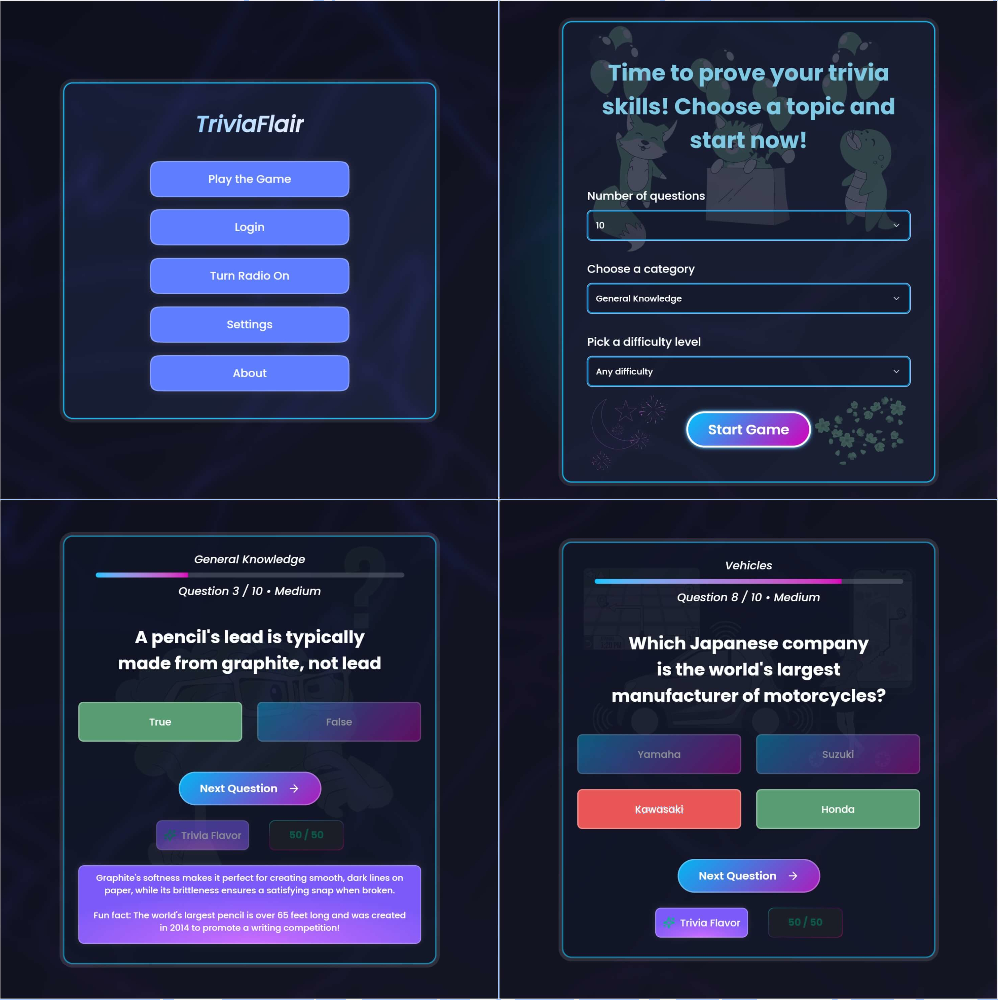

# 🧠 Trivia Flair 3.0

[](https://trivia-game-v3-frontend.onrender.com/)

A full-stack trivia game with integrated radio player! Built with React, TypeScript, Node.js, and MongoDB. Features trivia gameplay, AI-powered hints, and a fully functional radio widget with thousands of live stations.

🎮 **Live Demo**: [Frontend](https://trivia-game-v3-frontend.onrender.com/) | [Backend API](https://trivia-game-v3-backend.onrender.com)



## ✨ What's New in 3.0

### 🎵 **Radio Widget**
- 📻 30,000+ live radio stations worldwide
- 🔍 Search by country, tags, or station name
- ⭐ Favorite stations with persistent storage
- 🔊 Real-time audio streaming with Howler.js
- 🎛️ Volume control and playback management
- 📱 Responsive retro-style design


### 🔐 **User System** 
- 👤 User registration and authentication
- 🔐 JWT token-based authentication
- 🗄️ MongoDB user data storage
- 📱 Persistent login sessions

### 🚀 **Backend Infrastructure**
- 🛡️ Proxy server for Radio Browser API
- ⚡ Load balancing across multiple radio servers
- 💾 Caching for improved performance
- 🔄 Exponential backoff for error handling

[Backend Repository](https://github.com/Akiz-Ivanov/trivia-game-v3-backend)

## 🎯 Features

### Trivia Game
- 🎯 Customizable categories, difficulty, and question count
- ⚡ Fast game flow with smooth animations
- 🧠 AI-powered hints & fun facts (DeepInfra Llama 3)
- 🐢 Minimal Mode: disable sound/animations/illustrations
- 📱 Fully responsive and accessible

### Radio Player
- 🌍 Global station database
- 🔍 Advanced search and filtering
- ⭐ Favorites system with localStorage
- 🔊 High-quality audio streaming
- 🎛️ Professional playback controls

## 🛠️ Tech Stack

### Frontend
- **React 19** + TypeScript
- **Tailwind CSS 4.0** with custom themes
- **Framer Motion** for animations
- **ShadCN/Radix UI** components
- **Howler.js** for audio handling
- **React Hook Form** + **Zod** for validation
- **Axios** for API calls
- **React Virtuoso** for performant lists
- **React Fast Marquee** for scrolling text/UI effects
- **Fuse.js** for search & fuzzy matching
- **Sonner** for notifications

### Backend
- **Node.js** + **Express**
- **MongoDB** + **Mongoose**
- **JWT** authentication + **bcrypt** hashing
- **Radio Browser API** integration
- **Caching** and **load balancing**

## 🎮 How to Play

- **Start Trivia** 
   - Set the number of questions (10-50)
   - Choose from various categories like Science, History, Entertainment, and more
   - Select your preferred difficulty level (Easy, Medium, Hard)
   - Click "Start Game"
- **Answer Questions**  
   - Use keyboard or mouse to select answers  
   - Track your score and see correct/incorrect answers after each question
   - Click the **Trivia Flavor** button to reveal extra info or fun facts about the question
- **Get Help**
   - Use **50/50 elimination** or **Get a hint** from AI when stuck
- **Listen to Radio**
   - Click the **radio icon** in the bottom corner
   - Browse **30,000+ stations** from around the world
   - Search by popular, country, music genre, or station name
   - Control volume and playback without leaving your game
   - **Save Favorites** by clicking the star icon
   - You can **dock/minimize the radio** while playing trivia
- **Adjust Settings**
   - Disable animations/illustrations for better performance  
   - Toggle background patterns, sounds, or minimal mode for a cleaner interface

## 🙏 Acknowledgments

### APIs & Services
- **OpenTriviaDB** for trivia questions  
- **DeepInfra** for AI-powered hints  
- **Radio Browser API** for radio station data  

### Assets & Libraries
- **Lucide** for icons  
- **Storyset** for illustrations  
- **Freepik** for SVGs 
- **Vecteezy** for additional vector graphics

## Installation

1. **Clone the repository**  

```bash
git clone https://github.com/Akiz-Ivanov/trivia-game-v3-frontend
cd trivia-game-v3-frontend
```

2. **Install dependencies**

```bash
npm install
```

3. **Environment setup**
- Create .env in the frontend root:

```bash
VITE_API_URL=your_backend_url_here
VITE_DEEPINFRA_API_KEY=your_deepinfra_api_key
```

4. **Run development server**

```bash
npm run dev
```